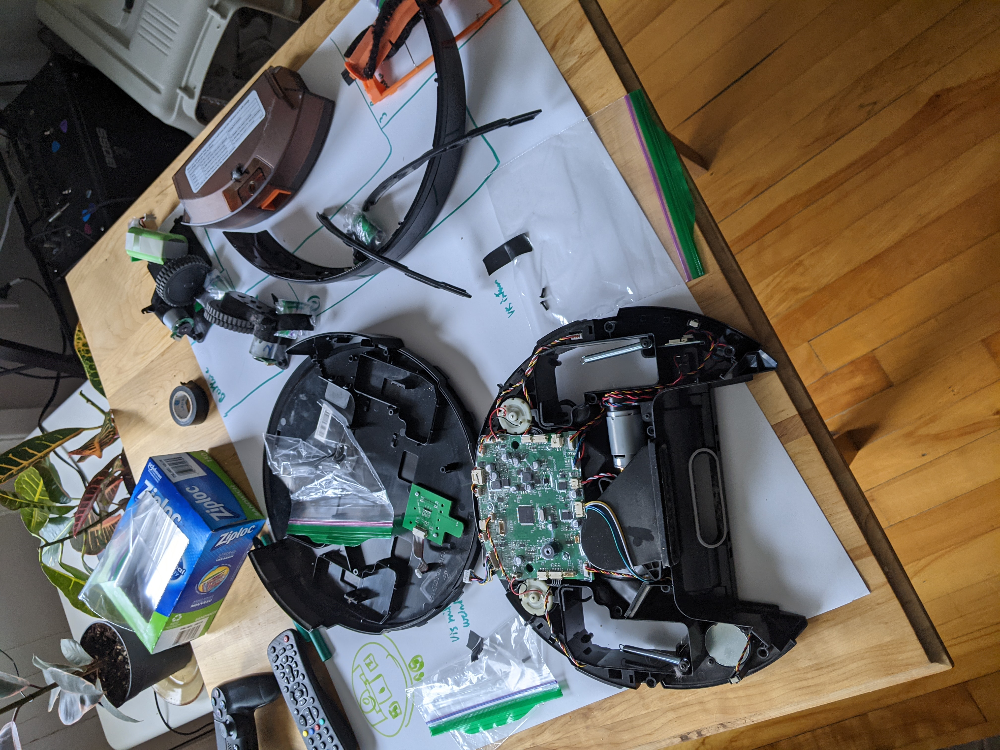

# Project: Hacking my Roomba so it can shoot me (with an airsoft gun)

Hello There!

This is a new project where I am trying to hack my IoT vaccum to shoot me with an airsoft gun. I will detail here my tought process and what works and what doesn't. The vaccum is the: Kyvol CyboVac E20 Robot Vaccuum Cleaner.

Enjoy!


# Looking at the Hardware

The vaccuum was pretty simple to take apart. I then realized that approaching this problem on the hardware side was stupid. So I went with the route of capturing Wi-Fi packets sent to the vaccum and reproducing them to make the vaccum do what I wanted it to do.




# Capturing Wi-Fi packets

-Setting up system to sniff Wi-Fi packets

https://linuxhint.com/capture_wi-fi_traffic_using_wireshark/

See tutorial to see how I set up Wi-Fi sniffing on my computer.

-Installing and resolving the error in Wireshark

https://linuxhint.com/install-and-use-wireshark-on-manjaro-linux/

It works!! Onto the next thing.

# Analyze Wi-Fi packets sent to and from the Vaccum

The vaccum sends udp updates each 5 seconds, can't seem to decipher them. When I try to see incomig packets. No packets appears after pressing the keys.

# Extracting APK

Extracted the APK using an APK Extractor.

Sent .apk file to Computer.

Converted .apk to .jar with dex2jar

Opened extracted code with JD-GUI

All code is now available to look at in case of need.

Not a lot of valuable information or don't know where to look.

# Using adb to control the app with python.

Downloading and enabling adb for python script in app

I connect using two computers because my main (Manjaro) can't seem to access Pixel Phone
```
Mac:
1) Connect phone
2) Allow
3) adb devices
4) adb tcpip 5555
Main:
5) adb devices
6) adb connect IPADDR:5555
6.1)Accept incoming connection
7) adb devices
```
Sources:
https://stackoverflow.com/questions/31327839/adb-over-wireless-without-usb-cable-at-all-for-not-rooted-phones/31327918

https://help.famoco.com/developers/dev-env/adb-over-wifi/

# Setting up the raspberry Pi

1)Flash Image with RPI Imager (Desktop Legacy)

1.1) `echo '' > .ssh/known_hosts`

1.2) SSH

1) `sudo raspi-config` Interface Enable VNC + Change display resolution

2) Log in VNC trough VNC

3) Install normal

4) Enable camera in settings

# Streaming video from pi to local web-server

See `client.py` for script

Source: https://randomnerdtutorials.com/video-streaming-with-raspberry-pi-camera/

# Using openCV to analyse human shape

See `server.py` for script

To see:
Non-Maxima Suppression (Pemettrait de pas avoir des multiboxes)
https://www.pyimagesearch.com/2015/11/16/hog-detectmultiscale-parameters-explained/
https://www.pyimagesearch.com/2015/02/16/faster-non-maximum-suppression-python/
Faire Carre milieu.
Deduire mouvement gauche droite selon le carré
When detected for

# Modeling in CAD

To insert stl upload to cloud
Creat Fusion design
Insert into project

Modeling almost done for 3d printed parts
https://www.youtube.com/watch?v=tQEmtbaO2GY

# Step Motor

28BYJ-48 stepper motor and ULN2003 Motor Arduino Driver